# AsyncInnManagementSystem
The Async Inn Management System is a web application designed to manage hotel data for a hotel chain called "Async Inn." The application allows hotel administrators to manage hotel information, room details, and amenities through a user-friendly interface.

## Entity Relationship Diagram (ERD)

## Overview of Relationships
The Async Inn Management System consists of three main entities: Hotel, Room, and Amenity.
- ### Hotel Entity:

The Hotel entity represents a single hotel location in the Async Inn chain.It has a one-to-many relationship with the Room entity, as each hotel can have multiple rooms.
It also has a many-to-many relationship with the Amenity entity, as each hotel can offer multiple amenities, and each amenity can be available at multiple hotels.
- ### Room Entity:

The Room entity represents an individual hotel room.
It has a many-to-one relationship with the Hotel entity, as each room belongs to a specific hotel.
It also has a many-to-many relationship with the Amenity entity, as each room can have multiple amenities, and each amenity can be available in multiple rooms.
- ### Amenity Entity:

The Amenity entity represents various amenities offered by the hotels, such as Wi-Fi, TV, etc.
It has a many-to-many relationship with both Hotel and Room entities, as explained above
 ## Using :
 To run the Async Inn Management System, follow these steps:

- Clone the repository to your local machine.
- Ensure you have the required dependencies, including .NET Core and SQL Server.
- Set up the database connection string in the appsettings.json file.
- Run the migrations to create the database tables and seed the initial data.
- Build and run the application using dotnet run or using your preferred IDE.

## Technologies Used
- C#
- Entity Framework
- ASP.NET Web API
- SQL Server

## Conroller 
You can check it by using that end point 

     /api/Hotels

 ## Contributions
Contributions to the Async Inn Management System are welcome! If you find any bugs or have ideas for enhancements, feel free to contact me .
 

##  Architecture Pattern: Repository Design Pattern
The Repository Design Pattern is a software design pattern that separates the data access logic from the rest of the application. It acts as an intermediary between the data source (database) and the application's business logic. The pattern allows for better organization of data access code and promotes code reusability.

### How it is used in the app:
- Interfaces for Controllers: For each of the controllers (Hotels, Rooms, Amenities), we have defined an interface that contains the required method signatures for performing CRUD operations directly on the database. These interfaces provide a contract for data access.

- Dependency Injection: The controllers have been refactored to depend on these interfaces rather than directly on the HotelDbContext. This promotes loose coupling between the controllers and the data access layer, making it easier to swap out data access implementations without affecting the controllers.

- Service Implementation: For each of the controllers, we have created a corresponding service class that implements the respective interface. The service classes contain the logic to satisfy the interface requirements and perform database operations using the HotelDbContext.

- Controller Update: The controllers have been updated to use the appropriate methods from the service classes instead of directly accessing the HotelDbContext. This ensures that data access logic is centralized in the service classes and not scattered throughout the controllers.

### Endpoints:
 ### Hotels:

- GET /api/Hotels: Get all hotels.
- GET /api/Hotels/{id}: Get a specific hotel by id.
- POST /api/Hotels: Create a new hotel.
- PUT /api/Hotels/{id}: Update an existing hotel.
- DELETE /api/Hotels/{id}: Delete a hotel.
 ### Rooms:

- GET /api/Rooms: Get all rooms.
- GET /api/Rooms/{id}: Get a specific room by id.
- POST /api/Rooms: Create a new room.
- PUT /api/Rooms/{id}: Update an existing room.
- DELETE /api/Rooms/{id}: Delete a room.
### Amenities:

- GET /api/Amenities: Get all amenities.
- GET /api/Amenities/{id}: Get a specific amenity by id.
- POST /api/Amenities: Create a new amenity.
- PUT /api/Amenities/{id}: Update an existing amenity.
- DELETE /api/Amenities/{id}: Delete an amenity.
## Routse for lab-14:
- GET: /api/Hotels/{hotelId}/Rooms

Action: GetRoomsByHotel(int hotelId)
Description: Retrieves all rooms for a specific hotel.

- POST: /api/Hotels/{hotelId}/Rooms

Action: AddRoomToHotel(int hotelId, HotelRoom room)
Description: Adds a room to a specific hotel.

- GET: /api/Hotels/{hotelId}/Rooms/{roomNumber}

Action: GetRoomByNumber(int hotelId, int roomNumber)
Description: Retrieves a specific room by its number in a hotel.

- PUT: /api/Hotels/{hotelId}/Rooms/{roomNumber}

Action: UpdateRoomDetails(int hotelId, int roomNumber, HotelRoom room)
Description: Updates the details of a specific room in a hotel.

- DELETE: /api/Hotels/{hotelId}/Rooms/{roomNumber}

Action: DeleteRoomFromHotel(int hotelId, int roomNumber)
Description: Deletes a specific room from a hotel.

- POST: /api/Rooms/{roomId}/Amenity/{amenityId}

Action: AddAmenityToRoom(int roomId, int amenityId)
Description: Adds an amenity to a specific room.

- DELETE: /api/Rooms/{roomId}/Amenity/{amenityId}

Action: RemoveAmenityFromRoom(int roomId, int amenityId)
Description: Removes an amenity from a specific room.
### Postman Testing:
Use Postman to test the different endpoints by sending HTTP requests to the appropriate URLs with JSON payloads for creating and updating data. Make sure to include the required headers and ensure that the data is correctly formatted as per the API specifications(Check Headers:
Verify that the Content-Type header is correctly set to "application/json" in the request. This header tells the server that the request body contains JSON data.).
## Lab 16 :
### Hotels

#### GET /api/Hotels/{id}

Retrieve information about a specific hotel.
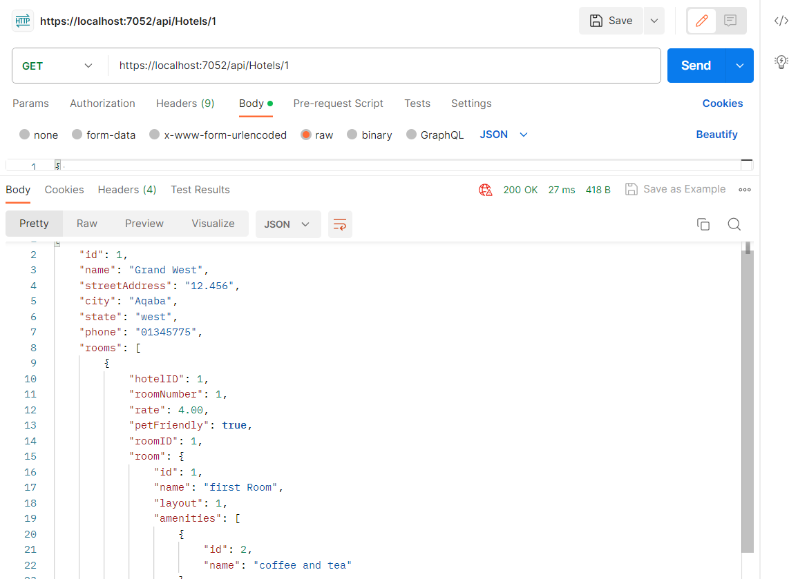
### GET /api/Hotels
Retrieve a list of all hotels.
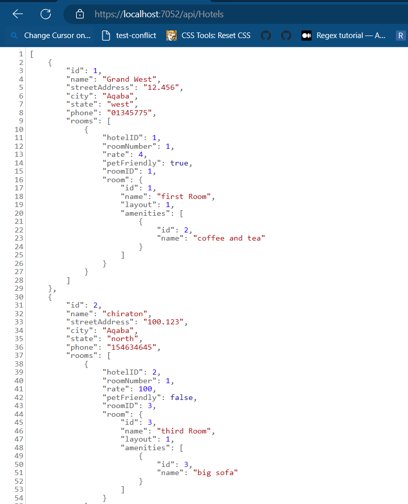
### HotelRooms
GET /api/Hotels/{hotelId}/Rooms/{roomNumber}
Retrieve information about a specific hotel room.

PUT /api/Hotels/{hotelId}/Rooms/{roomNumber}
Update information about a specific hotel room.

DELETE /api/Hotels/{hotelId}/Rooms/{roomNumber}
Delete a hotel room.

GET /api/Hotels/{hotelId}/Rooms
Retrieve a list of all rooms for a hotel.

POST /api/Hotels/{hotelId}/Rooms
Add a new room to a hotel.

Request Body:

                        {
                                    "hotelID": 1002,
                                    "roomNumber":1,
                                    "rate": 100.5,
                                    "petFriendly": true,
                                    "roomID": 3,
                                    "room": {
                                        "id": 3,
                                        "name": "third Room",
                                        "layout": 1,
                                        "amenities": [
                                            {
                                                "id": 2,
                                                "name": "coffee and tea"
                                            }
                                        ]
                                    }}

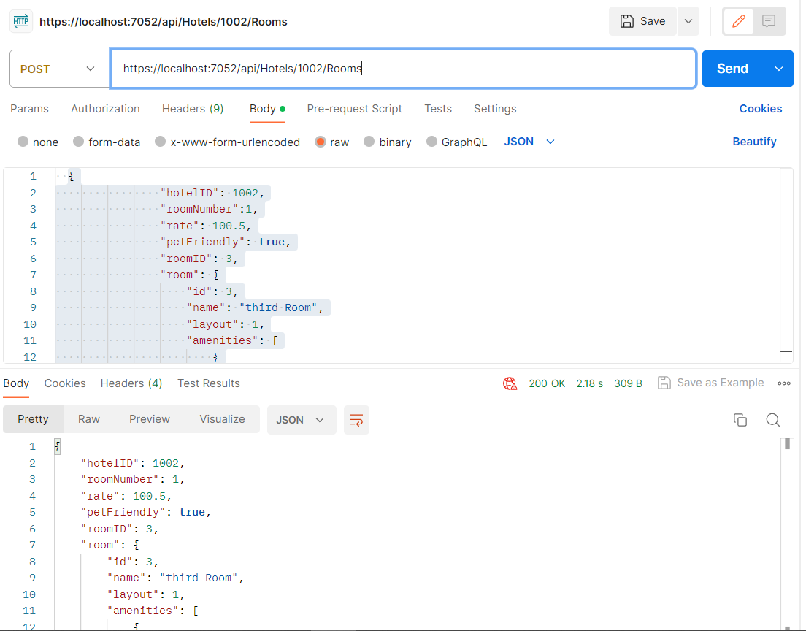

 ### Rooms
 GET /api/Rooms/{roomId}
Retrieve information about a specific room.

PUT /api/Rooms/{roomId}
Update information about a specific room.

GET /api/rooms
Retrieve a list of all rooms.

POST /api/rooms
Create a new room.

Request Body:

         {
                "id": 5,
                "name": "fifth Room",
                "layout": 3,
                "amenities": [
                    {
                        "id": 2,
                        "name": "coffee and tea"
                    }
                ]
            }
Result:

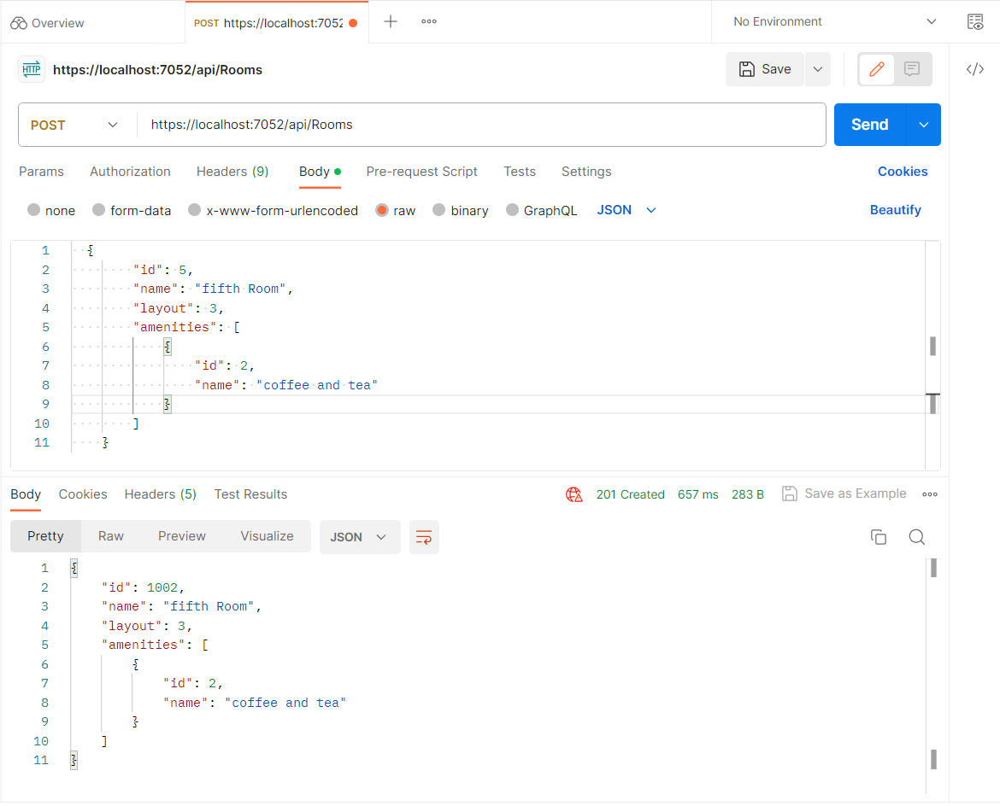

### Amenities
GET /api/amenities/{id}
Retrieve information about a specific amenity.

GET /api/amenities
Retrieve a list of all amenities.

POST /api/amenities
Create a new general amenity.

Request Body:

     {
    
        "name": "Coffee corner"
    }

Result :

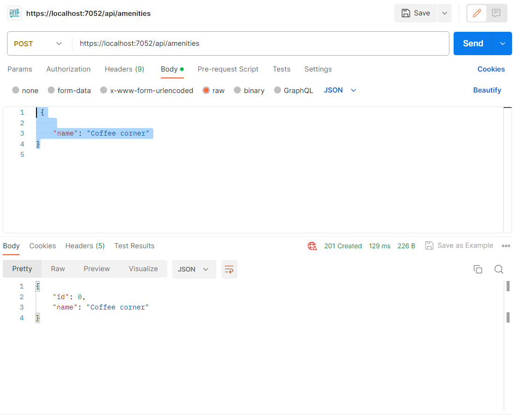

## Summary For Lab-17
 we worked on testing methods for an AsyncInn Management System using C# and Entity Framework Core. The system manages hotels, rooms, and amenities in a database. Our main focus was on writing unit tests to ensure the correct functionality of the services that interact with the database.
 ## Accomplishments
- **HotelServices Testing**: We wrote test methods for the HotelServices class. We covered creating new hotels, deleting hotels, and updating hotel information. We used a mock database context to isolate the tests and ensure they don't affect the real database.

- **RoomServices Testing**: Similar to the hotel services, we wrote test methods for the RoomServices class. We tested creating new rooms, deleting rooms, and updating room information. Again, we used a mock database context for testing.

## Overall
we made significant progress in testing the AsyncInn Management System, addressed errors, and gained insights into the best practices for writing unit tests in C#.

# Async Inn API with Identity Integration

## Introduction

This project integrates the Identity Framework into the Async Inn API. Identity is a framework provided by ASP.NET Core that enables user authentication and authorization in web applications. With Identity, you can manage user registration, login, and access control in a secure and efficient manner.
## Getting Started

To run this project locally, follow these steps:

1. Clone the repository to your local machine.
2. Set up your database connection in the `appsettings.json` file.
3. Run migrations to create the necessary database tables
4. Run The application .

## User Registration
- Open your preferred API testing tool (such as Postman) or just run the test which will use swagger.
- Send a POST request to the following endpoint to register a new user:
        
      - POST /api/Users/Register
- Include the following JSON data in the request body:
 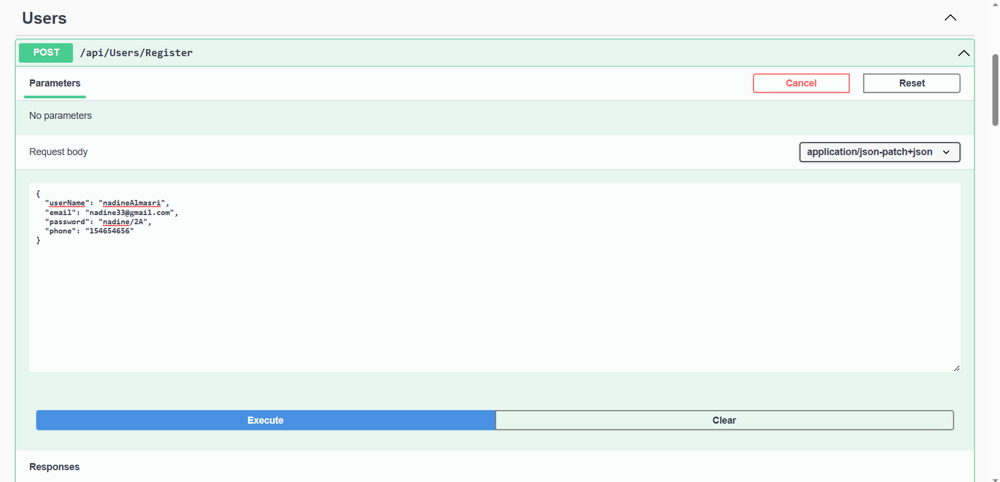
- Upon successful registration, you will receive a response indicating the user's UserName and a unique user ID.

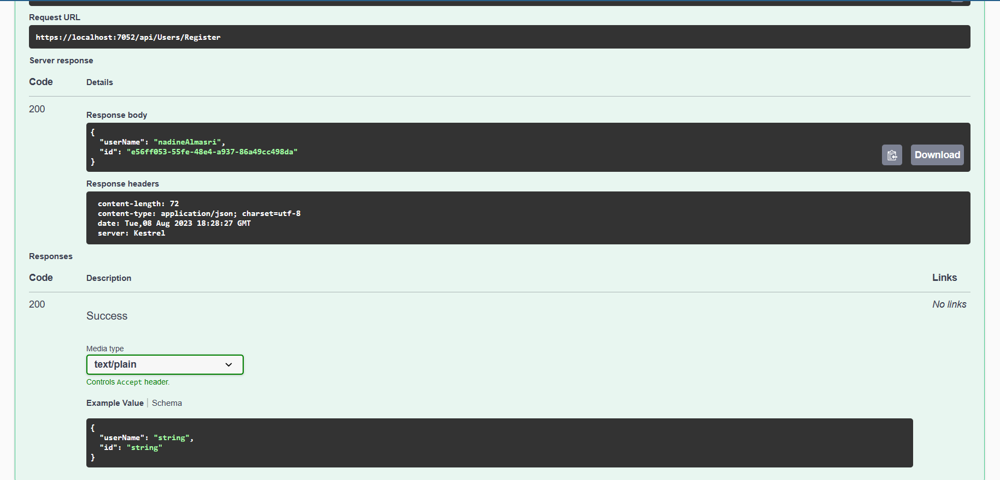
## User Login

- Send a POST request to the following endpoint to authenticate a user:

        POST /api/Users/login
- Include the following JSON data in the request body:
 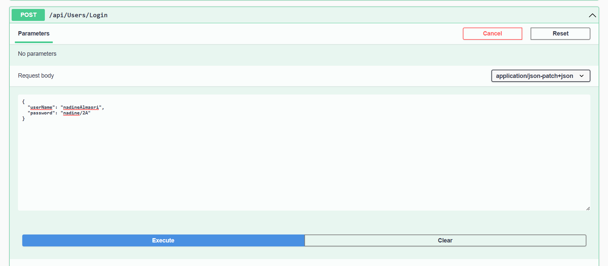
- If the credentials are correct, you will receive a response with a Success authentication indicating the user's UserName and  user ID.
 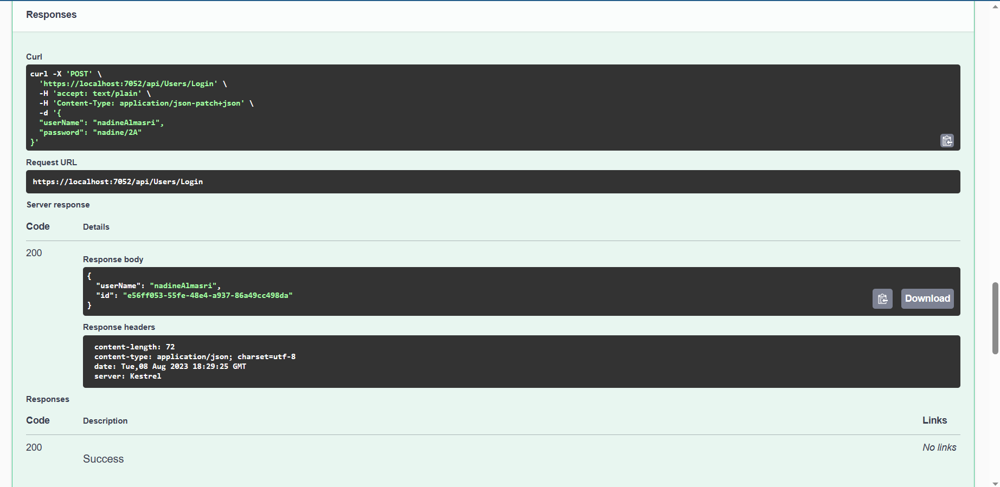
 ## Conclusion
By integrating Identity into the Async Inn API, you've enabled secure user registration and authentication. Identity handles the complex aspects of user management, leaving you with a robust foundation for building user-centric applications.

For a visual representation of the process flow surrounding User Registration and Login, refer to the UML diagram provided in the project's documentation.
 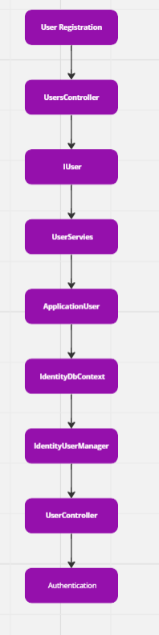

# lab 19
## Features
- District Managers can perform CRUD operations on Hotel, HotelRoom, Room, and Amenity entities.
- Property Managers can add/update/read HotelRooms to hotels and amenities to rooms.
- Agents can update/read HotelRooms and add/delete amenities to rooms.
- Anonymous users can view GET routes.
- District Managers can create accounts for all roles.
- Property Managers can only create accounts for Agents.
## add and test the token 
 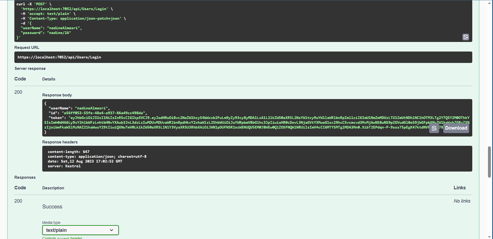
  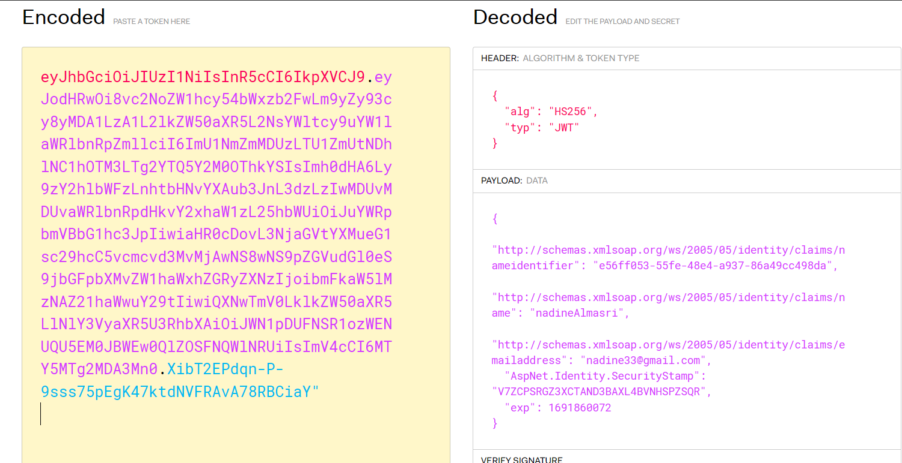
## make the profile rout as a role only for distract manger 
 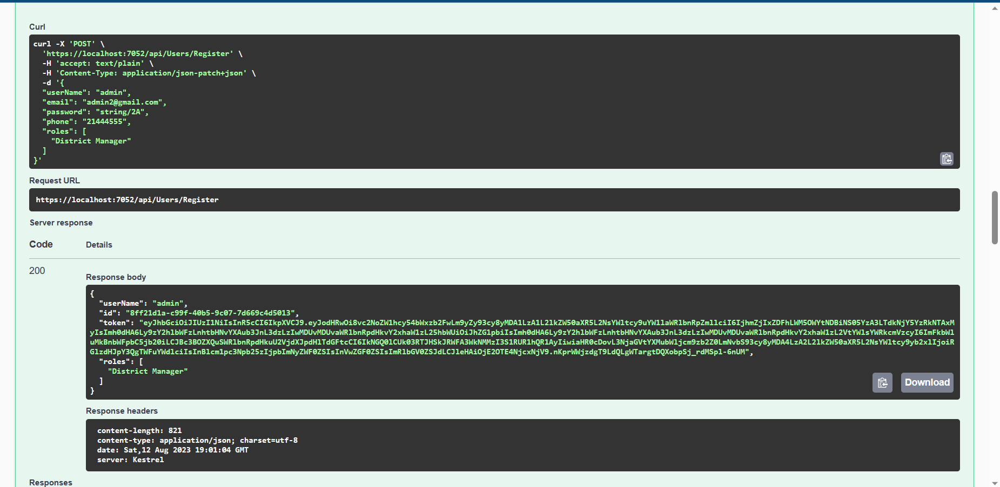
  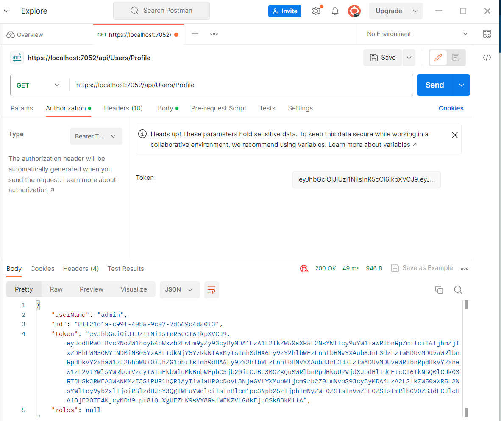
 
  ## Conclusion
  In conclusion, today's work on the AsyncInn Management System marks a significant step towards creating a robust and user-friendly hotel management application. By implementing user roles, access controls, API endpoints, registration, and login functionalities, we have laid the foundation for a secure and efficient platform that caters to the specific needs of different users within the hospitality industry.