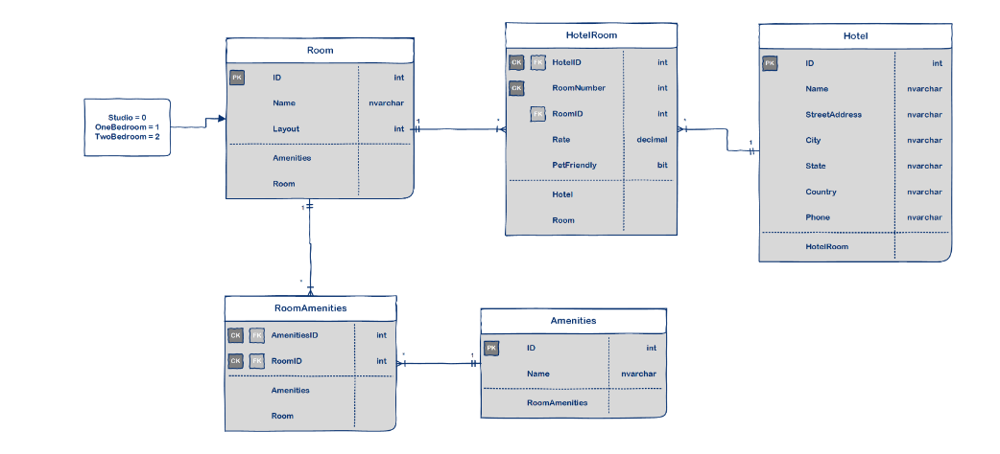

# AsyncInnManagementSystem
The Async Inn Management System is a web application designed to manage hotel data for a hotel chain called "Async Inn." The application allows hotel administrators to manage hotel information, room details, and amenities through a user-friendly interface.

## Entity Relationship Diagram (ERD)

## Overview of Relationships
The Async Inn Management System consists of three main entities: Hotel, Room, and Amenity.
- ### Hotel Entity:

The Hotel entity represents a single hotel location in the Async Inn chain.It has a one-to-many relationship with the Room entity, as each hotel can have multiple rooms.
It also has a many-to-many relationship with the Amenity entity, as each hotel can offer multiple amenities, and each amenity can be available at multiple hotels.
- ### Room Entity:

The Room entity represents an individual hotel room.
It has a many-to-one relationship with the Hotel entity, as each room belongs to a specific hotel.
It also has a many-to-many relationship with the Amenity entity, as each room can have multiple amenities, and each amenity can be available in multiple rooms.
- ### Amenity Entity:

The Amenity entity represents various amenities offered by the hotels, such as Wi-Fi, TV, etc.
It has a many-to-many relationship with both Hotel and Room entities, as explained above
 ## Using :
 To run the Async Inn Management System, follow these steps:

- Clone the repository to your local machine.
- Ensure you have the required dependencies, including .NET Core and SQL Server.
- Set up the database connection string in the appsettings.json file.
- Run the migrations to create the database tables and seed the initial data.
- Build and run the application using dotnet run or using your preferred IDE.

## Technologies Used
- C#
- Entity Framework
- ASP.NET Web API
- SQL Server

## Conroller 
You can check it by using that end point 

     /api/Hotels

 ## Contributions
Contributions to the Async Inn Management System are welcome! If you find any bugs or have ideas for enhancements, feel free to contact me .
 

##  Architecture Pattern: Repository Design Pattern
The Repository Design Pattern is a software design pattern that separates the data access logic from the rest of the application. It acts as an intermediary between the data source (database) and the application's business logic. The pattern allows for better organization of data access code and promotes code reusability.

### How it is used in the app:
- Interfaces for Controllers: For each of the controllers (Hotels, Rooms, Amenities), we have defined an interface that contains the required method signatures for performing CRUD operations directly on the database. These interfaces provide a contract for data access.

- Dependency Injection: The controllers have been refactored to depend on these interfaces rather than directly on the HotelDbContext. This promotes loose coupling between the controllers and the data access layer, making it easier to swap out data access implementations without affecting the controllers.

- Service Implementation: For each of the controllers, we have created a corresponding service class that implements the respective interface. The service classes contain the logic to satisfy the interface requirements and perform database operations using the HotelDbContext.

- Controller Update: The controllers have been updated to use the appropriate methods from the service classes instead of directly accessing the HotelDbContext. This ensures that data access logic is centralized in the service classes and not scattered throughout the controllers.

### Endpoints:
 ### Hotels:

- GET /api/Hotels: Get all hotels.
- GET /api/Hotels/{id}: Get a specific hotel by id.
- POST /api/Hotels: Create a new hotel.
- PUT /api/Hotels/{id}: Update an existing hotel.
- DELETE /api/Hotels/{id}: Delete a hotel.
 ### Rooms:

- GET /api/Rooms: Get all rooms.
- GET /api/Rooms/{id}: Get a specific room by id.
- POST /api/Rooms: Create a new room.
- PUT /api/Rooms/{id}: Update an existing room.
- DELETE /api/Rooms/{id}: Delete a room.
### Amenities:

- GET /api/Amenities: Get all amenities.
- GET /api/Amenities/{id}: Get a specific amenity by id.
- POST /api/Amenities: Create a new amenity.
- PUT /api/Amenities/{id}: Update an existing amenity.
- DELETE /api/Amenities/{id}: Delete an amenity.
### Postman Testing:
Use Postman to test the different endpoints by sending HTTP requests to the appropriate URLs with JSON payloads for creating and updating data. Make sure to include the required headers and ensure that the data is correctly formatted as per the API specifications(Check Headers:
Verify that the Content-Type header is correctly set to "application/json" in the request. This header tells the server that the request body contains JSON data.).